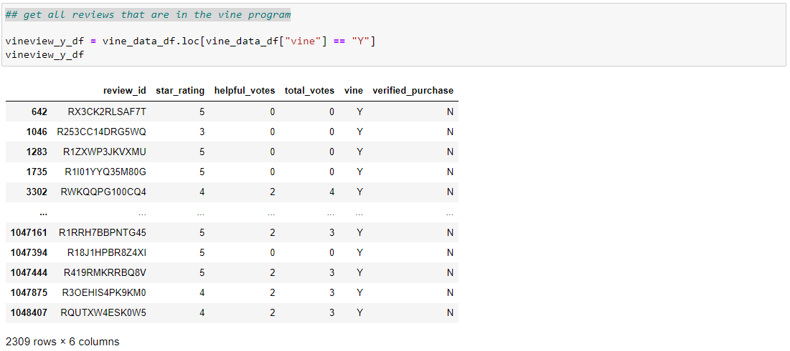
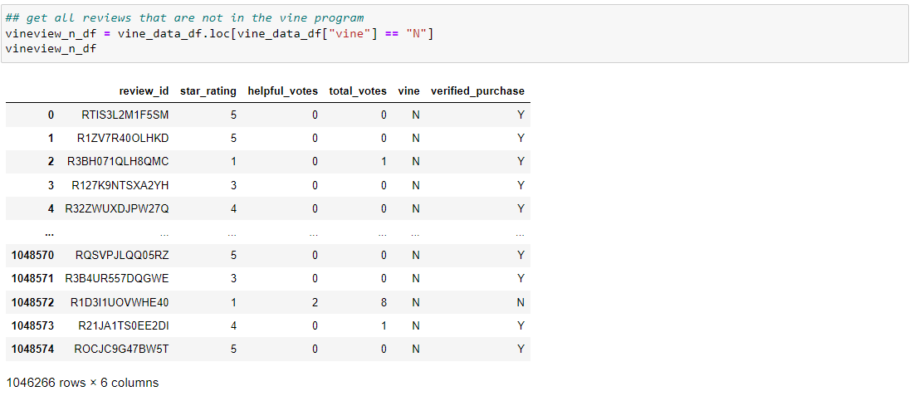

# Amazon_Vine_Analysis

## Overview of analysis

The goal of this of this project was to analyze ratings and compare Amazon reviews of members in the Vine program to members not in the program. 

### Purpose

In this project a relational database was created in AWS. This was created to connect to PGadmin for analysis. Spark was used to organize the data so that it could be written to tables with the desired schema in PGadmin. Then the data 
in the vine table was exported to a csv (in order to minimize cost) and analyzed in python. In jupyter notebook I used pandas dataframes in order to filter down the information to derive conclusions regarding the Vine program.

## Results

How many Vine reviews and non-Vine reviews were there?
 
* There were 2,309 Vine reviews and 1,046,266 non-Vine reviews.

Vine Reviews: 

non-Vine Reviews: 

How many Vine reviews were 5 stars? How many non-Vine reviews were 5 stars?

* There were 929 5 star vine reviews and 660,931 5 star non-vine reviews.

What percentage of Vine reviews were 5 stars? What percentage of non-Vine reviews were 5 stars?

* The percentage of 5 star reviews in the vine program 40% and the percentage of 5 star reviews not in the vine program 63%.

## Summary

Based on the numbers found without context it seems that there is a negativity bias among those in the Vine program. Assuming this is taken at face value, this could be a result of higher quality reviews (the ones marked helpful) to be 
less likely to be rated 5. They might not overall be more negative, they could still have a higher average rating, but just be less likely to rate a product 5 stars. It could be the case that the less serious reviewers provide ratings 
that are more likely to be 1 or 5 if they had a very positive or very negative experience, but not as likely to review in the middle. The Vine members might just be more nuanced in their ratings. In addition, there is no information on 
the types of products they are rating. It is possible that the Vine members are disproportionately rating lower end products. The way the data was analyzed was ultimately insufficient to make a final determination on whether the Vine 
program has a positivity bias.   
 
### Additional Analysis

As mentioned earlier there is a significant amount of information that needs to be added to this analysis. First, a comparison between helpful reviews in Vine and non-Vine members to see if there is a discrepancy if helpful reviews are 
less likely to give 5 star ratings. Another piece of data that would be interesting to compare would be the average values amongst both groups. Finally, I would want to compare the average rating (if there is an IMDB equivalent for video 
games) and see if the groups have discrepancies amongst the quality of products they are reviewing.  

